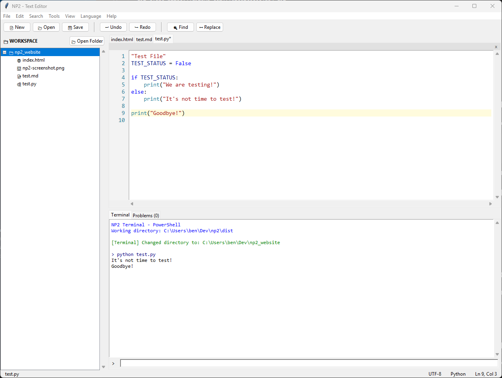

# NP2 - Text Editor

**NP2** is a lightweight, cross-platform text editor inspired by Notepad++, built with Python 3 and Tkinter. It aims to provide a familiar, fast, and capable editing experience without the bloat of Electron-based editors.



## Features
- **Syntax Highlighting**: Supports 50+ languages via Pygments.
- **Tabbed Interface**: Open multiple files simultaneously.
- **Search & Replace**: fast find and replace functionality.
- **Line Numbers**: standard features for coding.
- **Autocomplete**: basic text completion.
- **Linting**: integrated basic linting support.
- **Cross-Platform**: Runs on Windows, Linux, and macOS.

## Installation & Running

### Prerequisites
- Python 3.8+
- pip

### Setup
1. Clone the repository:
   ```bash
   git clone https://github.com/flatdotcodes/np2.git
   cd np2
   ```

2. Install dependencies:
   ```bash
   pip install -r requirements.txt
   ```

3. Run the application:
   ```bash
   python main.py
   ```

## Building Exe (Windows)
You can build a standalone executable using PyInstaller (also available as a pre-compiled binary under the releases tab):

```bash
pip install pyinstaller
pyinstaller --noconsole --onefile --name NP2 main.py
```
The executable will be located in the `dist/` folder.

## Project Structure
- `main.py`: Entry point.
- `editor/`: core editor components (`text_editor.py`, `app.py`, `tab_manager.py`).
- `utils/`: utility functions for file handling, language detection, etc.
- `panels/`: UI panels (search, terminal, workspace).
- `linting/`: linter integration logic.
- `tests/`: benchmark and unit tests.

## Current Status
This project is currently in active development.
- **Working**: Core editing, saving/loading, tabs, syntax highlighting, basic search.
- **In Progress**: Advanced code intelligence, plugin system.
- **Known Issues**: Large file performance (files > 1MB) involves a "Performance Mode" fallback.

## License
MIT License
